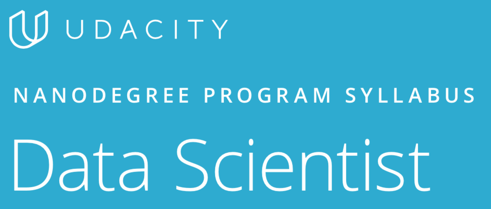
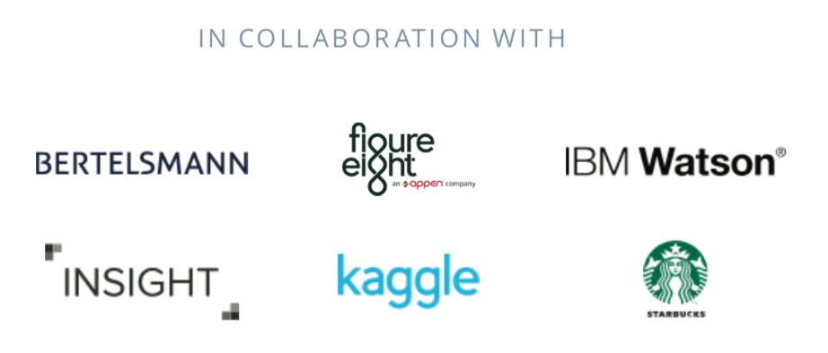

<p align="center">
  
</p>
# Data Science Nanodegree

The ultimate goal of the Data Scientist Nanodegree program is learn the skills to perform well as a data scientist. As a graduate of this program, you will be able to:
* Use Python and SQL to access and analyze data from several different data sources.
* Use principles of statistics and probability to design and execute A/B tests and recommendation engines to assist businesses in making data-automated decisions..
* Deploy a data science solution to a basic flask app.
* Manipulate and analyze distributed datasets using Apache Spark. • Communicate results effectively to stakeholders.

<p align="center">
  
</p>

## Run

Set up your virtual environment and activate it.

 ```bash
python3.6 -m venv venv
source venv/bin/activate
pip install -r requirements.txt
jupyter-notebook
```

